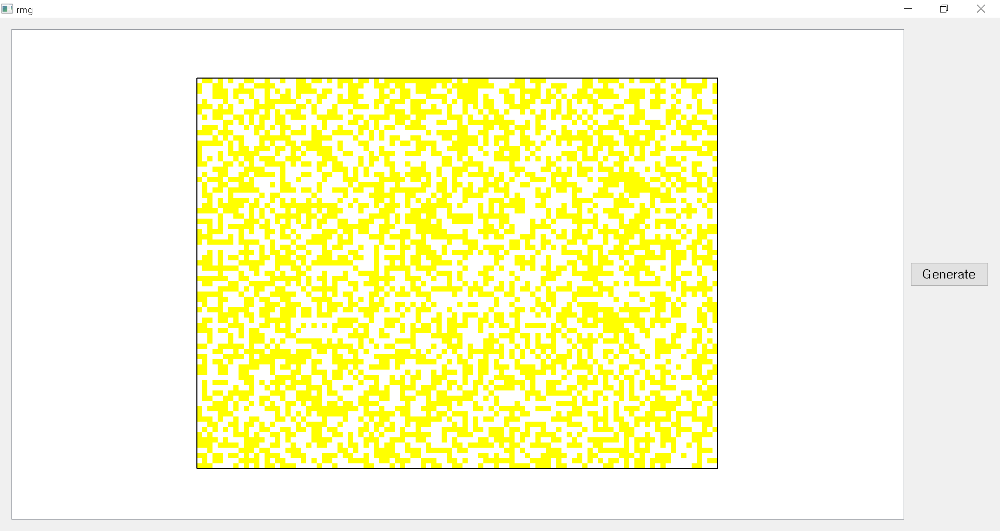

# random-matrix-generator
Random small dot covered matrix generator

## Requirements
PyQt5 >= 5.8

## Setup
```
pip install git+https://github.com/yjg30737/random-matrix-generator.git --upgrade
```

## Example

Code
```python
from PyQt5.QtWidgets import QWidget, QApplication, \
    QHBoxLayout, QPushButton

from random_matrix_generator import RandomMatrixGraphicsView


class RmgExample(QWidget):
    def __init__(self):
        super().__init__()
        self.__initUi()

    def __initUi(self):
        self.setWindowTitle('rmg')
        self.__rmg = RandomMatrixGraphicsView()
        self.__rmg.setHDotCount(100) # set count of horizontal dots
        self.__rmg.setVDotCount(75) # set count of vertical dots
        self.__rmg.setDotSize(5) # set the size of each dots
        self.__rmg.setBorder(True) # set the border which surrounds the matrix
        genBtn = QPushButton('Generate')
        genBtn.clicked.connect(self.generate)
        lay = QHBoxLayout()
        lay.addWidget(self.__rmg)
        lay.addWidget(genBtn)

        self.setLayout(lay)

    def generate(self):
        self.__rmg.generate()


if __name__ == "__main__":
    import sys

    app = QApplication(sys.argv)
    rmgExample = RmgExample()
    rmgExample.show()
    app.exec()
```
Result



If you click generate button once more, matrix won't reset; It will be more covered by another random generated dots. I will make an option of that soon enough.


